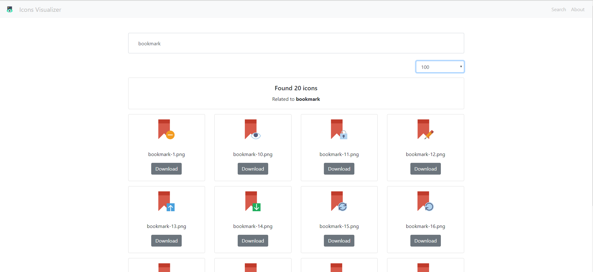

# Icons Visualizer

<p align="center">
    <a href="https://travis-ci.org/flavienbwk/icons-visualizer" target="_blank">
        
    </a>
    <a href="https://opensource.org/licenses/MIT" target="_blank">
        
    </a>
</p>

A quick and simple UI and API to search and display icons. Can be used in an offline environment thanks to Docker.



Written in Python (Flask RESTPlus / Swagger) and ReactJS.

## Get started

First, import the icons you want in the `icons/` directory.

:warning: **The names of your files** are very important : the search engine is based on filenames to find keywords as you type the icon you're looking for in the UI searchbar.

### Build for dev

```bash
docker-compose up -d
```

You can access the UI at `localhost:8080`

### Build for prod

```bash
docker-compose -f prod.docker-compose.yml up -d
```

You can access the UI at `localhost:8080`
